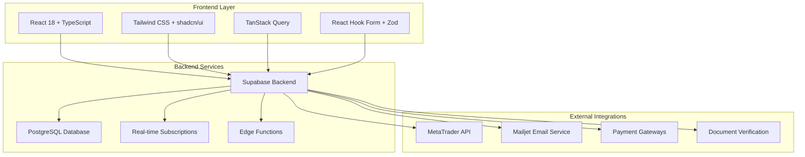

# 🏦 Peaceful Investment Platform

[](https://github.com/your-username/peaceful-investment-platform)
[](LICENSE)
[](https://www.typescriptlang.org/)
[](https://reactjs.org/)
[](https://vitejs.dev/)

A comprehensive, professional-grade investment platform built with modern web technologies. Manage your trading strategies, monitor performance, and optimize your investment portfolio with enterprise-level tools and analytics.

## ✨ Features

### 🎯 Core Platform
- **Advanced Trading Dashboard** - Real-time monitoring and strategy management
- **MetaTrader Integration** - Seamless MT4/MT5 broker connectivity
- **Portfolio Management** - Comprehensive asset tracking and analysis
- **Risk Management** - Advanced risk assessment and mitigation tools

### 👥 User Management
- **Multi-tier Authentication** - Secure user and admin access controls
- **Role-based Permissions** - Granular access control system
- **KYC/AML Compliance** - Document verification and compliance workflows
- **Profile Management** - Comprehensive user profile and settings

### 💼 Business Features
- **Referral System** - Automated commission tracking and payments
- **Overseas Company Setup** - International business entity management
- **Request Management** - Streamlined client request processing
- **Analytics & Reporting** - Detailed performance metrics and insights

### 🛡️ Security & Compliance
- **End-to-end Encryption** - Bank-grade security protocols
- **Audit Logging** - Comprehensive activity tracking
- **GDPR Compliance** - Privacy-first data handling
- **SOC 2 Ready** - Enterprise security standards

## 🏗️ Architecture



## 🚀 Quick Start

### Prerequisites

- **Node.js** 18+ and **pnpm** (recommended) or npm
- **Supabase Account** for backend services
- **MetaTrader Account** for trading integration

### Installation

1. **Clone the repository**
```bash
git clone https://github.com/your-username/peaceful-investment-platform.git
cd peaceful-investment-platform
```

2. **Install dependencies**
```bash
pnpm install
# or
npm install
```

3. **Environment Setup**
```bash
cp .env.example .env
# Edit .env with your configuration
```

4. **Start development server**
```bash
pnpm dev
# or
npm run dev
```

Visit `http://localhost:8080` to see the application.

## ⚙️ Configuration

### Environment Variables

Create a `.env` file in the root directory:

```env
# Supabase Configuration
VITE_SUPABASE_URL=your_supabase_project_url
VITE_SUPABASE_ANON_KEY=your_supabase_anon_key

# Mailjet Configuration
VITE_MAILJET_API_KEY=your_mailjet_api_key
VITE_MAILJET_SECRET_KEY=your_mailjet_secret_key
VITE_MAILJET_SENDER_EMAIL=your_sender_email

# Application Configuration
VITE_APP_NAME=Peaceful Investment
VITE_APP_URL=http://localhost:8080
```

### Database Setup

1. Create a new Supabase project
2. Run the migrations in `supabase/migrations/`
3. Configure Row Level Security (RLS) policies
4. Set up storage buckets for document uploads

## 🛠️ Development

### Available Scripts

```bash
# Development
pnpm dev              # Start development server
pnpm build            # Build for production
pnpm preview          # Preview production build

# Code Quality
pnpm lint             # Run ESLint
pnpm lint:fix         # Fix ESLint issues
pnpm type-check       # Run TypeScript checks
pnpm format           # Format code with Prettier
pnpm format:check     # Check code formatting

# Utilities
pnpm clean            # Clean build artifacts
```

### Development Guidelines

- **TypeScript First** - All new code must be properly typed
- **Component Structure** - Follow the established component patterns
- **State Management** - Use TanStack Query for server state
- **Styling** - Use Tailwind CSS with the established design system
- **Testing** - Write tests for critical business logic

## 📁 Project Structure

```
src/
├── components/          # Reusable UI components
│   ├── ui/             # shadcn/ui component library
│   ├── admin/          # Admin-specific components
│   ├── create-account/ # Account creation flow
│   └── ...
├── pages/              # Route components
├── hooks/              # Custom React hooks
├── services/           # API and external service integrations
├── utils/              # Utility functions and helpers
├── config/             # Configuration files
└── templates/          # Email and document templates
```

## 🔧 Technology Stack

### Frontend
- **React 18** - Modern React with concurrent features
- **TypeScript** - Type-safe development
- **Vite** - Fast build tool and dev server
- **Tailwind CSS** - Utility-first CSS framework
- **shadcn/ui** - High-quality component library
- **TanStack Query** - Server state management
- **React Hook Form** - Form handling with validation
- **Zod** - Schema validation

### Backend
- **Supabase** - Backend-as-a-Service
- **PostgreSQL** - Primary database
- **Edge Functions** - Serverless functions
- **Real-time** - Live data synchronization
- **Storage** - File and document storage

### External Services
- **MetaTrader API** - Trading platform integration
- **Mailjet** - Email delivery service
- **Payment Gateways** - Financial transaction processing

## 🚢 Deployment

### Production Build

```bash
pnpm build
```

### Docker Deployment

```bash
# Build Docker image
docker build -t peaceful-investment .

# Run container
docker run -p 8080:80 peaceful-investment
```

### Environment-Specific Builds

```bash
# Development build
pnpm build:dev

# Production build
pnpm build
```

## 📊 Performance

- **Lighthouse Score**: 95+ across all metrics
- **Bundle Size**: Optimized with code splitting
- **Loading Time**: < 2s initial load
- **Real-time Updates**: < 100ms latency

## 🤝 Contributing

We welcome contributions! Please see our [Contributing Guidelines](CONTRIBUTING.md) for details.

### Development Workflow

1. Fork the repository
2. Create a feature branch (`git checkout -b feature/amazing-feature`)
3. Make your changes
4. Run tests and linting (`pnpm lint && pnpm type-check`)
5. Commit your changes (`git commit -m 'Add amazing feature'`)
6. Push to the branch (`git push origin feature/amazing-feature`)
7. Open a Pull Request

## 📄 License

This project is licensed under the MIT License - see the [LICENSE](LICENSE) file for details.

## 🔒 Security

For security vulnerabilities, please email security@peacefulinvestment.com instead of using the issue tracker.

## 📞 Support

- **Documentation**: [docs.peacefulinvestment.com](https://docs.peacefulinvestment.com)
- **Issues**: [GitHub Issues](https://github.com/your-username/peaceful-investment-platform/issues)
- **Discussions**: [GitHub Discussions](https://github.com/your-username/peaceful-investment-platform/discussions)
- **Email**: support@peacefulinvestment.com

## 🙏 Acknowledgments

- Built with ❤️ by the Peaceful Investment Team
- Special thanks to our beta testers and early adopters
- Powered by the amazing open-source community

---

<div align="center">
  <strong>Built with modern technologies for the future of investment management</strong>
  <br />
  <a href="https://peacefulinvestment.com">🌐 Website</a> •
  <a href="https://docs.peacefulinvestment.com">📚 Documentation</a> •
  <a href="https://github.com/your-username/peaceful-investment-platform/issues">🐛 Report Bug</a> •
  <a href="https://github.com/your-username/peaceful-investment-platform/discussions">💬 Request Feature</a>
</div>